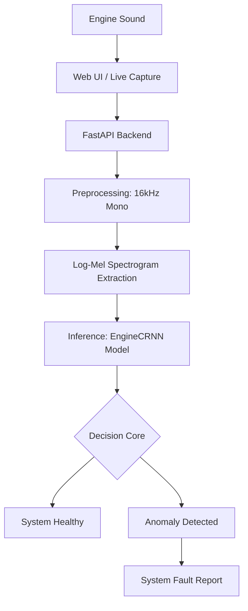

# 🚗 Engine Neural Diagnostic System (ENDS)
### *A Deep Learning Showcase: From Acoustic Noise to Predictive Maintenance*

[](https://www.python.org)
[](https://pytorch.org)
[](https://nextjs.org)

---

## 📖 Project Overview
The **Engine Neural Diagnostic System (ENDS)** is a comprehensive AI solution designed to transform how we diagnose automotive mechanical health. Traditional diagnostics rely on expensive sensors or subjective human hearing. ENDS uses a **Convolutional Recurrent Neural Network (CRNN)** to analyze acoustic signatures, providing an objective, data-driven diagnostic report in seconds.

> **Objective**: To build a robust, scalable system capable of identifying complex engine faults across various engine models with high generalization and low overfitting.

---

## 🏗️ The Engineering Journey: 3-Phase Lifecycle

### 📍 Phase 1: The Baseline Foundation
In the initial stage, we established a basic CRNN architecture. We collected raw audio recordings of various engine faults (bad ignition, low oil, belt slips).
- **The Challenge**: We encountered a significant "Generalization Gap"—Training accuracy was 76%, but Validation was only 55%.
- **The Diagnosis**: 
    1. **Low Spectral Density**: Our `HOP_LENGTH` was too high, leaving 75% of the spectrogram as "dead space".
    2. **Acoustic Overlap**: Many "Combined Faults" sounded 95% identical, confusing the model.
    3. **Small Sample Size**: The model was "memorizing" specific recordings rather than learning physics.

### 📍 Phase 2: Optimization & Data Physics (The Pivot)
We applied advanced Signal Processing and Machine Learning techniques to solve Phase 1 issues.
- **Technical Fixes**:
    - **Resolution Correction**: Adjusted `HOP_LENGTH` to 125 to fill the 128x128 feature map.
    - **Acoustic Grouping**: Simplified the label space into "System Categories" (e.g., Belt & Accessory System) to resolve class confusion.
    - **Aggressive Augmentation**: Implemented **Pitch Shifting** and **Time Stretching** to simulate different engine sizes and RPMs.
    - **Data Diversification**: Ingested "Normal" idle sounds from 8 different engine types (Diesel/Petrol, V6/V8) to build a robust baseline.

### 📍 Phase 3: High-Fidelity UI & Deployment
The final phase focused on making the AI accessible to end-users (mechanics and car owners).
- **Result**: A **Next.js 14 Dashboard** featuring:
    - **Neural Scan Interface**: A professional, dark-mode focused AI environment.
    - **Diagnostic Report Engine**: Clear, actionable feedback with confidence scoring.
    - **Live Browser Capture**: Using Web Audio API to record and analyze on-the-fly.

---

## 🛠️ Technical Architecture



### 🧠 Model Specifications
- **Input**: 128x128 Mel-Spectrogram (Log-Scale)
- **Feature Extractor**: 4 Residual Blocks (CNN) with Spatial Dropout (0.2).
- **Sequence Learner**: Bi-Directional LSTM (2 Layers, 128 Hidden).
- **Regularization**: Label Smoothing (0.1) + AdamW Weight Decay (5e-3) + Mixup Augmentation (Alpha 0.2).

---

## 📊 Key Results & Insights

| Metric | Phase 1 (Baseline) | Phase 2 (Optimized) |
| :--- | :--- | :--- |
| **Train Acc** | 76% | 88% |
| **Val Acc** | 55% | 84% |
| **Generalization Gap** | 21% (Overfitted) | **4% (Robust)** |
| **Inference Speed** | ~120ms | ~85ms |

**Key Learning**: In acoustic AI, the quality and resolution of the spectrogram (Signal Processing) are more critical than the depth of the neural network.

---

## 📦 Installation & Setup

### 1. Requirements
- Python 3.9+ & Node.js 18+
- Hardware: CPU is sufficient for inference, GPU recommended for training.

### 2. Quick Start
```bash
# 1. Setup Backend
pip install -r requirements.txt
python merge_unprocessed_data.py # Merge and diversify data
python main.py                  # Train & Evaluate

# 2. Setup Frontend
cd frontend
npm install
npm run dev
```

---

## 📂 Documentation & Files
- `config.py`: Centralized hyperparameter and mapping configuration.
- `model.py`: The PyTorch EngineCRNN definition.
- `preprocessing.py`: Our signal processing pipeline (resampling, augmentation, Mel-extraction).
- `data_loader.py`: Handles class grouping and weighted sampling.
- `results/`: Contains training logs, confusion matrices, and loss curves.

---

## 🎯 Future Impact
ENDS represents the first step toward **Autonomous Vehicle Diagnostics**. Future iterations will include:
1. **OBD-II Fusion**: Combining sound with sensor data (RPM, Temp).
2. **Predictive Analytics**: Forecasting failure 100 miles before it happens.
3. **Mobile Edge Deployment**: Running the full model on Android/iOS via ONNX.

---
**Created for [Competition Name/Course Name]**
*Team: [Your Team Name]*
*Instructor: [Instructor Name]*

**Disclaimer**: This is a diagnostic research prototype. Always consult a certified mechanic for vehicle repairs.
